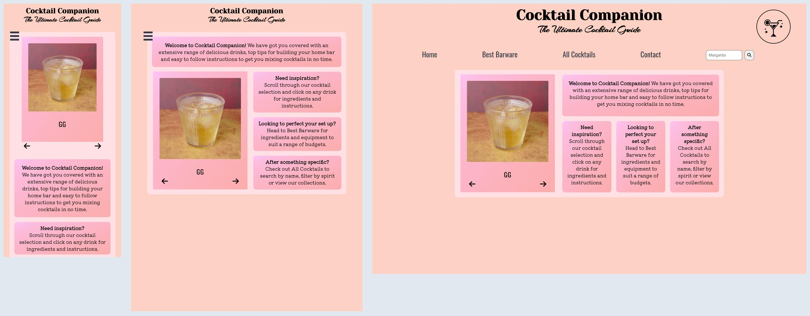

# Cocktail Companion

 

Your online guide for making cocktails, built collaboratively by Jose Wills, [Camilla Priest-Stephens](https://github.com/cprieststephens), and [Matt Mullins](https://github.com/mullinsmmm).

The initial idea for this project was conceptualised by [Max Tauroza](https://github.com/max-tau)  

We designed the site using Figma, used Trello for planning and general project organisation, and Slack for communication.
 
We managed our project using the scrum agile methodology to deliver the MVP before our deadline, and prioritised our tasks using the MosCoW method.

Our tests were written using Jest and React Testing Library.

The data is fetched from [the cocktail database API](https://www.thecocktaildb.com/api.php)

## Description

Includes hundreds of ideas for cocktails with the following information:

- Name
- Image
- Glassware
- Ingredients
- Instructions
- Video (not all cocktails have this data)

You can search by name, filter by spirit, get random cocktails, or a selection of the most popular.

Also includes a page with a guide to buying barware depending on user budget

## Packages & Frameworks

- React & Testing Library
- Axios
- Font Awesome
- Jest

## How to use

Head to [the cocktail companion](https://cocktail-companion.onrender.com/) and remember to drink responsibly!
 
